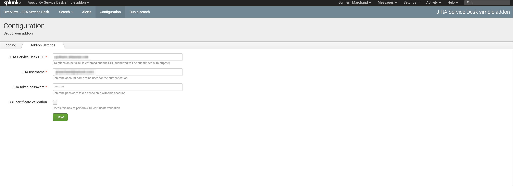
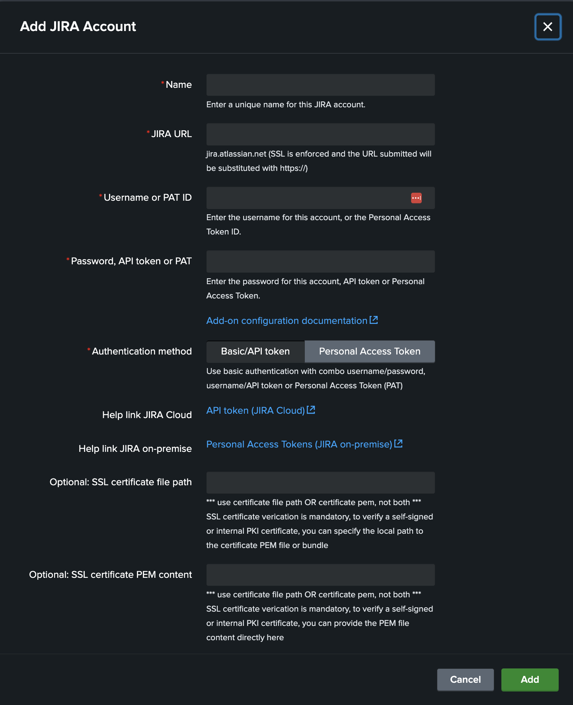
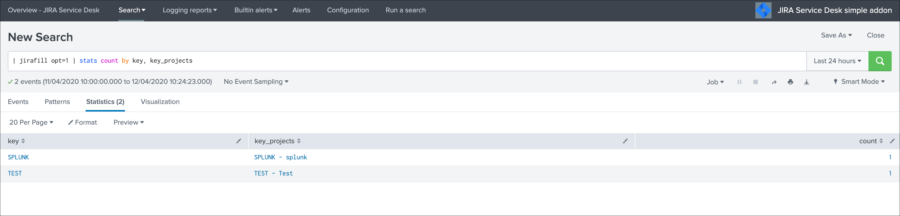

Configuration
#############

*Configuration page:*

Configure your JIRA instance
============================

**Enter the configuration page in the UI to setup the JIRA instance URL and credentials to be used.**

The Splunk Add-on for JIRA service desk uses basic authentication as described here:

- https://developer.atlassian.com/server/jira/platform/basic-authentication

**The JIRA instance configuration requires:**

- The JIRA URL which is https enforced, you can define the instance without the protocol like "myjira.mydomain.com" or "https://myjira.domain.com"
- The user name to be used for authentication
- The secret token defined for this user

Optionally you can request for SSL certificates validation during the REST call made to JIRA api during the issue creation, which will require the certificates of the instance to be fully valid.

Logging level
=============

The logging level can be defined within the configuration page too, the application makes a real usage of the debug mode and will generate many more messages in debug.

In normal circumstances, the logging level should be defined to INFO, required logging level will automatically be used when any unexpected error is encountered.

Validating the connectivity
===========================

**You can validate the connectivity very easily by simulating the creation of an alert, if the JIRA project and associated information are made available, the connection is successful:**

- Enter a search window
- type ``|makeresults``
- Click save as new alert
- Scroll down to alert actions and add the JIRA Service Desk action

**You can as well directly call the custom commands achieving the retrieval of the JIRA project in a simple search:**

::

| jirafill opt=1 | stats count by key, key_projects

If the command returns the list of your JIRA projects, then the connectivity is successful:

