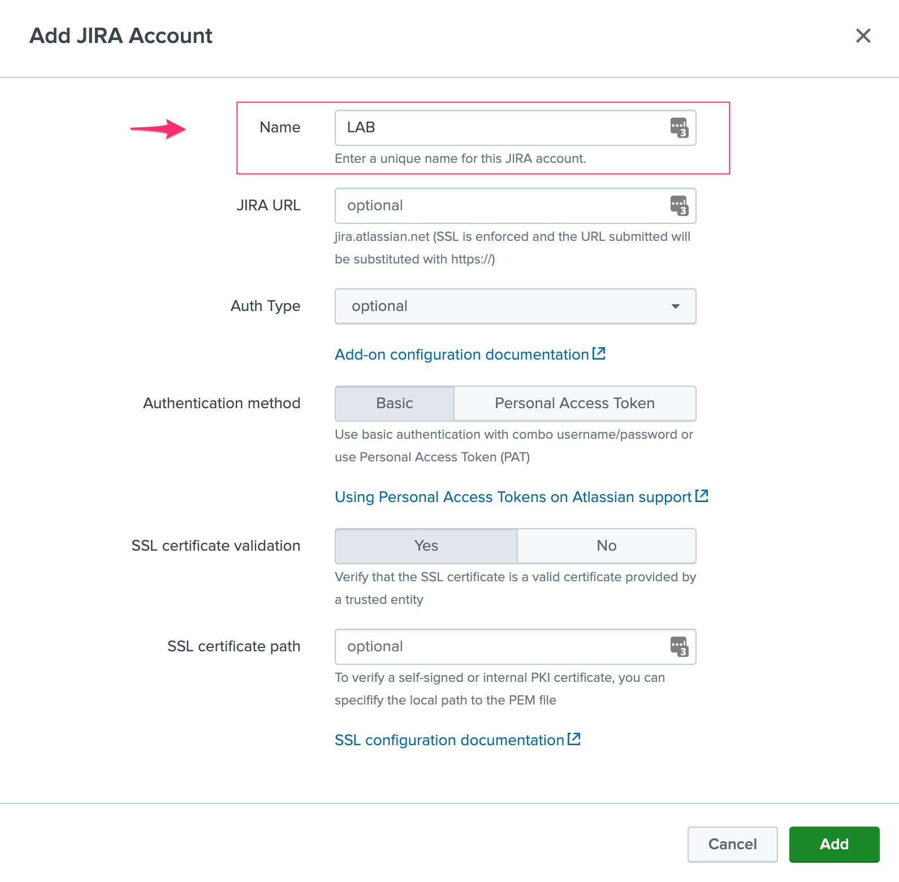

Configuration
#############

Configuring in Splunk Web
=========================

Usually, the configuration should be achieved via Splunk Web and the configuration UI:

*Configuration page:*

.. image:: img/config1.png
   :alt: config1.png
   :align: center
   :width: 1200px   

In a Search Head Cluster context, the generated configuration is automatically replicated across the members of the cluster.

Configuring via REST API
========================

Alternatively, and this can be useful if for some reason you cannot access to the configuration UI (no end dead loop), the configuration can easily be achieved via REST calls to the Splunk API with curl.

Configuring the JIRA instance via curl
^^^^^^^^^^^^^^^^^^^^^^^^^^^^^^^^^^^^^^

Assuming:

- JIRA instance URL: ``myjira.mydomain.com:8443``
- JIRA login username: ``admin``
- JIRA password: ``ch@ngeM3``

You would run the following curl command, either locally on a search head (in SHC, this will be replicated automatically), or remotely reaching out to a search head:

::

   curl -k -u admin:'ch@ngeM3' -X POST https://localhost:8089/servicesNS/nobody/TA-jira-service-desk-simple-addon/TA_jira_service_desk_simple_addon_settings/additional_parameters -d 'jira_url=myjira.mydomain.com:8443' -d 'jira_username=admin' -d 'jira_password=ch@ngeM3'

You can verify your settings with a GET:

::

   curl -k -u admin:'ch@ngeM3' -X GET https://localhost:8089/servicesNS/nobody/TA-jira-service-desk-simple-addon/TA_jira_service_desk_simple_addon_settings/additional_parameters

Enabling SSL validation
^^^^^^^^^^^^^^^^^^^^^^^

If you wish to enable the SSL certificate validation:

::

   curl -k -u admin:'ch@ngeM3' -X POST https://localhost:8089/servicesNS/nobody/TA-jira-service-desk-simple-addon/TA_jira_service_desk_simple_addon_settings/additional_parameters -d 'jira_ssl_certificate_validation=1'

*See "About SSL certificate validation"*

Specifying the SSL certificate to be verifed
^^^^^^^^^^^^^^^^^^^^^^^^^^^^^^^^^^^^^^^^^^^^

If you wish to enable the SSL certificate validation and you need to validate an internal certificate:

::

   curl -k -u admin:'ch@ngeM3' -X POST https://localhost:8089/servicesNS/nobody/TA-jira-service-desk-simple-addon/TA_jira_service_desk_simple_addon_settings/additional_parameters -d 'jira_ssl_certificate_path=/etc/ssl/server.pem'

*See "About SSL certificate validation"*

Enabling the passthrough mode
^^^^^^^^^^^^^^^^^^^^^^^^^^^^^

To enable the passthrough mode:

::

   curl -k -u admin:'ch@ngeM3' -X POST https://localhost:8089/servicesNS/nobody/TA-jira-service-desk-simple-addon/TA_jira_service_desk_simple_addon_settings/additional_parameters -d 'jira_passthrough_mode=1'

Setting the logging mode
^^^^^^^^^^^^^^^^^^^^^^^^

To enable DEBUG logging:

::

   curl -k -u admin:'ch@ngeM3' -X POST https://localhost:8089/servicesNS/nobody/TA-jira-service-desk-simple-addon/TA_jira_service_desk_simple_addon_settings/logging -d 'loglevel=DEBUG'

Enable and configure the proxy
^^^^^^^^^^^^^^^^^^^^^^^^^^^^^^

Example:

::

   curl -k -u admin:'ch@ngeM3' -X POST https://localhost:8089/servicesNS/nobody/TA-jira-service-desk-simple-addon/TA_jira_service_desk_simple_addon_settings/proxy -d 'proxy_enabled=1' -d 'proxy_url=myproxy.domain.com' -d 'proxy_port=8080'

Additional options are:

- proxy_username (string)
- proxy_password (string)
- proxy_rdns (boolean, 0 disabled, 1 enabled)
- proxy_type (http/socks4/socks5)

Configuration details
=====================

Configure your JIRA instance
^^^^^^^^^^^^^^^^^^^^^^^^^^^^

**Enter the configuration page in the UI to setup the JIRA instance URL and credentials to be used.**

The Splunk Add-on for JIRA service desk implements basic authentication as described here:

- https://developer.atlassian.com/server/jira/platform/basic-authentication
- https://developer.atlassian.com/cloud/jira/service-desk/basic-auth-for-rest-apis

**The JIRA instance configuration requires:**

- The JIRA URL which is https enforced, you can define the instance without the protocol like "myjira.mydomain.com" or "https://myjira.domain.com"
- The user name to be used for authentication
- The secret token defined for this user

Optionally you can request for SSL certificates validation during the REST call made to JIRA api during the issue creation, which will require the certificates of the instance to be fully valid.

About SSL certificate validation
^^^^^^^^^^^^^^^^^^^^^^^^^^^^^^^^

SSL usage is enforced, this means you cannot access to a JIRA instance if it is not using SSL.

**When using SSL, there might be different conditions:**

- The SSL certificate is from an official third party certificate authority and it is valid, you normally can tick the SSL validation box which enforces the fact that we expect the certificate to be valid. If the certificate is not valid, we will not allow any action to be performed.

- The SSL certificate is a self-signed certificate, you cannot verify the SSL certificate as it not a valid certificate, therefore the SSL validation box must not be ticked.

- The SSL certificate is from an internal PKI, it is valid but not trusted by default by the operating system, you can use the SSL certificate path to specifiy the local path to the corresponding certificate bundle and tick the validation box. If the file exists, it will be used during the REST calls, otherwise the SSL validation will be ignored.

For more information about validating an internal certificate: https://docs.python-requests.org/en/stable/user/advanced/#ssl-cert-verification

Logging level
^^^^^^^^^^^^^

The logging level can be defined within the configuration page too, the application makes a real usage of the debug mode and will generate many more messages in debug.

In normal circumstances, the logging level should be defined to INFO, required logging level will automatically be used when any unexpected error is encountered.

Validating the connectivity
^^^^^^^^^^^^^^^^^^^^^^^^^^^

**You can validate the connectivity very easily by opening any of the JIRA Get information reports, which achieve rest calls to the JIRA API to retrieve different information such as the list of projects available:**

.. image:: img/config_getprojects.png
   :alt: config_getprojects.png
   :align: center
   :width: 1200px   

Shall the connectivity be effective and if you open the Get projects report, the list of the JIRA projects available for your JIRA instance appears in the table.

::

| jirafill opt=1 | stats count by key, key_projects

If the command returns the list of your JIRA projects, then the connectivity is successful:

.. image:: img/config3.png
   :alt: config3.png
   :align: center
   :width: 1200px

**You can as well simulate the creation of an alert and action the JIRA Service Desk:**

- Enter a search window
- type ``|makeresults``
- Click save as new alert
- Scroll down to alert actions and add the JIRA Service Desk action

.. image:: img/config2.png
   :alt: config2.png
   :align: center
   :width: 800px

**Testing access and authentication with curl:**

You can as well very easily achieve a test with curl from the search head:

::

    curl -k https://<jira_url>/rest/api/latest/project --user <jira_username>:<jira_password>

Which, if successful, will return in a JSON format the list of projects available in your JIRA instance.

Using the alert action for non admin users
^^^^^^^^^^^^^^^^^^^^^^^^^^^^^^^^^^^^^^^^^^

**For non admin users to be able to use the alert action, the following role is provided out of the box:**

- jira_alert_action

This role needs to be inherited for the users, or your users to be member of this role.

**The role provides:**

- capability ``list_storage_passwords``
- capability ``list_settings``
- write permission to the resilient KVstore ``kv_jira_failures_replay``

JIRA passthrough mode
^^^^^^^^^^^^^^^^^^^^^

What is the JIRA passthrough?
-----------------------------

The passthrough has been designed for specific use cases where the Splunk main deployment is not capable of reaching directly the JIRA instance due to network and security constraints.

.. image:: img/passthrough_img001.png
   :alt: passthrough_img001.png
   :align: center
   :width: 1200px

This use case is common enough for Splunk Cloud customers running JIRA on-premise, due to security considerations, it may be refused or complex to open a connectivity between Splunk Cloud and the on-premise JIRA.

.. hint::

   - The JIRA passthrough requires a Splunk hybrid search head connected to Splunk Cloud
   - Work with Splunk Cloud teams and Splunk Professional Services to get the setup ready
   - The final setup will allow JIRA issues creation from alerts (correlation seaches in Enterprise Security) and ad-hoc adaptive response actions in incident review
   - In passthrough mode, the CSV/JSON attachment feature is not available
   - In passthrough mode, the JIRA dedup and auto-comment feature is not available

**In a nutshell:**

- The Splunk Cloud search head creates content in a local replay KVstore
- We rely on summary events to make the link betweem the Splunk Cloud environment and the on-premise hybrid search head
- The hybrid search performs the JIRA issue creation

**Using the passthrough mode can accomodate this scenario with some additional configuration and setup, things will work as:**

- The Splunk Cloud search head enabled the passthrough mode in the JIRA Add-on
- In this mode, the Add-on will not attempt to contact JIRA, instead it will insert issues to be created into the replay KVstore
- A scheduled report is created in the Splunk Cloud instance which looks at the content of the local replay KVstore and runs a collect command to generate summary events
- A scheduled report is created in the Splunk Cloud search head to purge processed issues by the hybrid search head (using logs generated by the hybrid and indexed in Splunk Cloud transparently)
- An on-premise Splunk search head is available in hybrid search mode, this means this search head can search in the Splunk Cloud indexers transparently
- The JIRA Add-on is installed in the hybrid search head, and the JIRA instance is properly configured (the hybrid search will create the issues)
- A scheduled report is created in the hybrid search head looking at the summary events, and filling its content to the local replay KVstore
- Natively, on the hybrid search head, the Add-on is looking at the replay KVstore and handles each record to be create as a new JIRA issue, and maintains (purges) the life cycle of the records upon their creation

Step 1: Get the JIRA Add-on installed
-------------------------------------

The JIRA Add-on must be installed to both the Splunk Cloud search, and the hybrid on-premise search head.

Step 2: Splunk Cloud - create a dummy configuration in the Add-on and enable the passthrough
--------------------------------------------------------------------------------------------

To accept creating records in the local replay KVstore, you first need to setup a dummy connection to JIRA.

The target is not important, it will not be used as soon when the passthrough is enabled, it is required to allow the Add-on to create records in the replay KVstore.

*Example:*

Step 3: Hybrid - configure the JIRA connectivity
------------------------------------------------

Make sure to setup properly the JIRA configuraton in the hybrid search head.

*Note: do not enable the passthrough mode in the hybrid search head!*

.. image:: img/passthrough_img003.png
   :alt: passthrough_img003.png
   :align: center
   :width: 1200px

Step 4: Splunk Cloud - create lookups to populate the alert action dropdown
---------------------------------------------------------------------------

In normal circumstances, the Add-on populates the dropdown (projects, issue types, priorities) dynamically by performing REST calls to JIRA.

In our case, this will not be possible, this can be managed by running the relevant commands on the hybrid search head, extracts these as CSV files, and upload these as lookup in Splunk Cloud.

Finally, we will customise the populating macros to call these lookups rather than the jirafill custom command which normally does the rest calls.

Get JIRA projects
^^^^^^^^^^^^^^^^^

Run the report **JIRA Service Desk - Get projects** from the hybrid search head (in the nav menu "Get JIRA INFO") and export as a CSV file:

.. image:: img/passthrough_img_get_projects.png
   :alt: passthrough_img_get_projects.png
   :align: center
   :width: 1200px

Run the report **JIRA Service Desk - Get issue types** from the hybrid search head (in the nav menu "Get JIRA INFO") and export as a CSV file:

.. image:: img/passthrough_img_get_issue_types.png
   :alt: passthrough_img_get_issue_types.png
   :align: center
   :width: 1200px

Run the report **JIRA Service Desk - Get issue priorities** from the hybrid search head (in the nav menu "Get JIRA INFO") and export as a CSV file:

.. image:: img/passthrough_img_get_issue_priorities.png
   :alt: passthrough_img_get_issue_priorities.png
   :align: center
   :width: 1200px

**Upload these lookups files in Splunk Cloud via Splunk Web, example:**

.. image:: img/passthrough_img006.png
   :alt: passthrough_img006.png
   :align: center
   :width: 1200px

.. hint::

   - Make sure the lookups are shared at the global level

**Finally, update the populating macros to use these lookups instead:**

*get_jira_projects:*

::

   inputlookup jira_projects.csv 

*get_jira_issue_types:*

::

   inputlookup jira_issue_types.csv 

*get_jira_priorities:*

::

   inputlookup jira_priorities.csv 

*Example:*

.. image:: img/passthrough_img007.png
   :alt: passthrough_img007.png
   :align: center
   :width: 1200px

Step 6: Splunk Cloud - disable replay out of the box reports
------------------------------------------------------------

Using Splunk Web, disable the report ``JIRA Service Desk - Resilient store Tracker``, this report must not be running from the Splunk Cloud search head as this job will be handled by the hybrid search head.

Step 7: Splunk Cloud - create a collect scheduled report
--------------------------------------------------------

In the Splunk Cloud search head, create a new scheduled report in the JIRA Add-on application space, ``scheduled every 5 minutes`` with the following code:

**JIRA - Collect replay KVStore:**

::

   | inputlookup jira_failures_replay | eval uuid=_key | eval _time=ctime
   | where _time>relative_time(now(), "-5m")
   | collect index=summary source=jira_replay_kvstore

.. hint::

   - This setup example uses the default summary index for the demonstration purposes, you can change this to a custom index of your choice

*Example:*

.. image:: img/passthrough_img008.png
   :alt: passthrough_img008.png
   :align: center
   :width: 800px

Step 8: Splunk Cloud - create a purge scheduled report
--------------------------------------------------------

In the Splunk Cloud search head, create a new scheduled report in the JIRA Add-on application space, ``scheduled every 15 minutes`` with the following code:

**JIRA - Purge processed issues in the replay KVstore:**

::

   | inputlookup jira_failures_replay | eval uuid=_key 
   | search NOT [ search (index="_internal" OR index="cim_modactions") (source="*jira_service_desk_replay_modalert.log") "Purging ticket in KVstore with uuid" | table uuid ]
   | eval _key=uuid
   | outputlookup jira_failures_replay

This job will purge records in the KVstore that have been successfully proceeded by the hybrid search head, thanks to the JIRA Add-on logging capabilities which inform us about the status of issues created from the replay KVstore.

*Example:*

.. image:: img/passthrough_img009.png
   :alt: passthrough_img009.png
   :align: center
   :width: 800px

Step 9 final: Hybrid search head - create a report recycling the summary events to feed the replay KVstore
----------------------------------------------------------------------------------------------------------

Finally, create a new scheduled report in the hybrid Splunk Search head, in the JIRA Add-on application space, ``scheduled every 5 minutes`` looking at the ``10 minutes`` of data, with the following code:

**JIRA - Collect and fill the replay KVstore:**

::

   index=summary source=jira_replay_kvstore
   | table ctime data mtime no_attempts status uuid
   | eval key=uuid
   | lookup jira_failures_replay _key as uuid OUTPUT _key as uuid_found
   | where isnull(uuid_found) | fields - uuid_found
   | outputlookup jira_failures_replay append=t key_field=key

.. hint::

   - If you used a different index in the previous step, make sure to reflect this change here

.. image:: img/passthrough_img010.png
   :alt: passthrough_img010.png
   :align: center
   :width: 800px

Final review
------------

Congratulations! The step is now terminated, because logs from the execution of the Hybrid search head are made avaiable to the Splunk Cloud search head (the hybrid forwards to the Splunk Cloud environment), the UI shows all the relevant information.

**For instance, the JIRA issues "created" on the Splunk Cloud search head, will appear in the first tab and tagged as info:**

.. image:: img/passthrough_img011.png
   :alt: passthrough_img011.png
   :align: center
   :width: 1200px

**The logs exposing the real creation of the issues via the replay KVstore are available in the second tab called "Resilient store activity":**

.. image:: img/passthrough_img012.png
   :alt: passthrough_img012.png
   :align: center
   :width: 1200px

The configuration is now over and fully functional, the hybrid search will respect the normal TA workflow, issues to be created will be removed automatically from the replay KVstore upon a successful creation.
