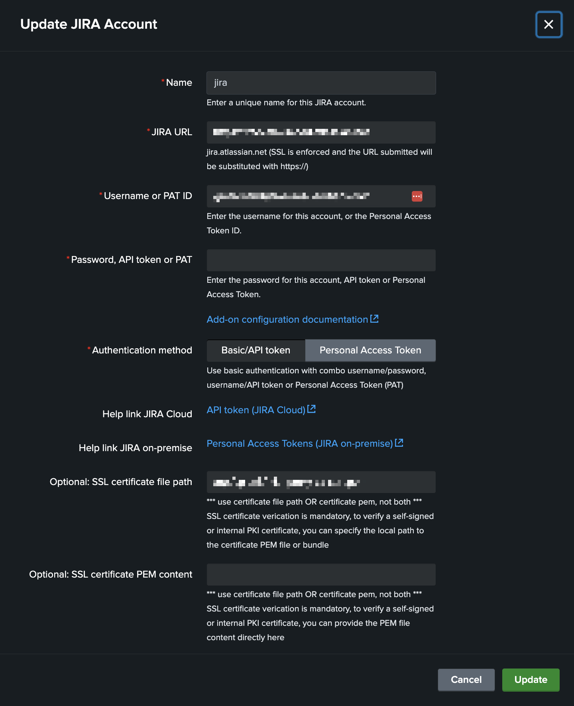
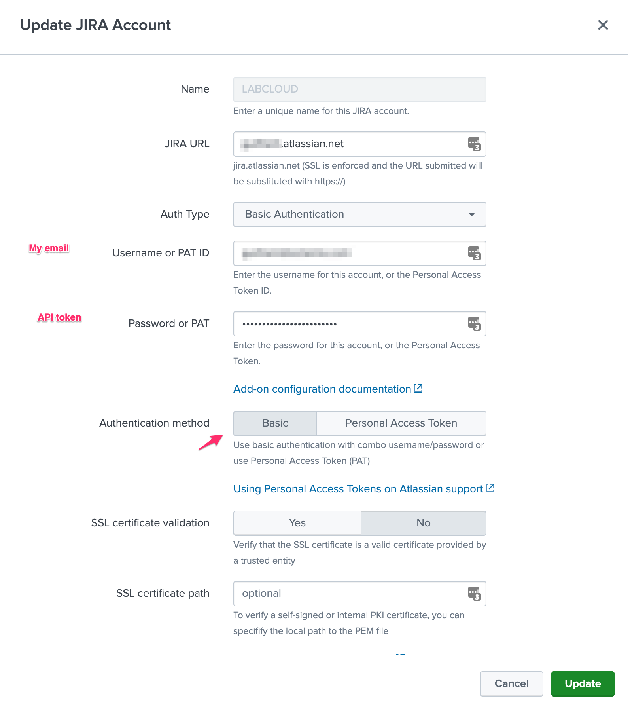
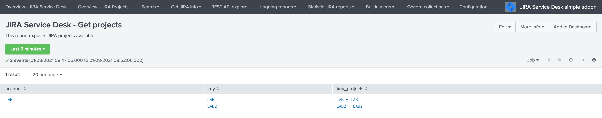

Configuration
#############

Configuring in Splunk Web
*************************

In normal circumstances, you will perform the configuration of the Add-on via the configuration UI in Splunk Web.

You cannot perform the account configuration manually by creating the expecting configuration files, these configuration items need to be handled and encrypted automatically.

In a Search Head Cluster context, the generated configuration is automatically replicated across the members of the cluster.

.. admonition:: **Automated connectivity validation**

   - Since the version 2.1.0, the Add-on performs an automated connectivity validation at the time of the account configuration.
   - This means that you cannot create an account, or update an existing account if the connectivity check fails. (network, authentication, etc.)
   - If the connectivity check fails, you will be prompted with the reason of the failure, review the reason for the failure and the response from the JIRA API.

*Configuration page:*

JIRA account configuration
==========================

The Add-on for JIRA supports multiple accounts to be configured, an account consists in the following parameters:

- **account name:** a name of your choice to represent this instance of JIRA
- **JIRA URL:** the URL value which will be used for this instance, in the format ``<address>:<port>``
- **Authentication type:** currently the Add-on supports ``basic authenticaton`` (user/password), ``API token`` (user/API token), and ``PAT`` (Personal Access Token)
- **SSL related configuration items:** SSL certificate verification and SSL certificate bundle

.. image:: img/config2.png
   :alt: config2.png
   :align: center
   :width: 600px 
   :class: with-border   

Configuring an account with API token for Atlassian Cloud
---------------------------------------------------------

**Atlassian Cloud requires you to setup an API token for the authentication, in a nutshell the API token replaces your password for enhanced security:**

- https://support.atlassian.com/atlassian-account/docs/manage-api-tokens-for-your-atlassian-account/

**To setup your API token, go to:**

- https://id.atlassian.com/manage-profile/security

**Then create an API token as following:**

**This token is what you will use in replacement of the password for Cloud services:**

**When you enter the JIRA URL, make sure to sure the proper URL:**

Configuring an account with Personal Access Token for JIRA on-premise (PAT)
---------------------------------------------------------------------------

The recommended way for the authentication to JIRA with the Add-on is to use Personal Access Tokens:

- https://confluence.atlassian.com/enterprise/using-personal-access-tokens-1026032365.html

*Example in JIRA Software:*

*Add-on PAT account configuration:*

- Enter the PAT ID
- Enter the PAT (stored encrypted)
- Select "Personal Access Token" in authentication method

Configuring an account with basic authentication
------------------------------------------------

Basic authentication relies on a traditional combo of username / password credentials:

*Add-on PAT account configuration:*

- Enter the username
- Enter the password (stored encrypted)
- Select "Basic" in authentication method

Configuring via REST API
************************

Alternatively, and this can be useful if for some reason you cannot access to the configuration UI (no end dead loop), the configuration can easily be achieved via REST calls to the Splunk API with curl.

Configuring the JIRA instance via curl
======================================

*PAT authentication (Personal Access Token)*

Assuming:

- Account name: ``LAB``
- JIRA instance URL: ``myjira.mydomain.com:8443``
- Authentication method: ``pat``
- JIRA PAT ID: ``splunk_svc``
- JIRA PAT: ``xxxxxxxxxxx``
- SSL certificate verification: ``disabled`` (0=disabled, 1=enabled)

You would run the following curl command, either locally on a search head (in SHC, this will be replicated automatically), or remotely reaching out to a search head:

::

   curl -k -u admin:'ch@ngeM3' -X POST https://localhost:8089/servicesNS/nobody/TA-jira-service-desk-simple-addon/ta_service_desk_simple_addon_account -d 'name=LAB' -d 'jira_url=myjira.mydomain.com:8443' -d 'auth_type=basic' -d 'username=splunk_svc' -d 'password=xxxxxxxxxxx' -d 'jira_auth_mode=pat' -d 'jira_ssl_certificate_validation=0'

*basic authentication (username / password)*

Assuming:

- Account name: ``LAB``
- JIRA instance URL: ``myjira.mydomain.com:8443``
- Authentication type: ``basic``
- JIRA login username: ``admin``
- JIRA password: ``ch@ngeM3``
- SSL certificate verification: ``disabled`` (0=disabled, 1=enabled)

You would run the following curl command, either locally on a search head (in SHC, this will be replicated automatically), or remotely reaching out to a search head:

::

   curl -k -u admin:'ch@ngeM3' -X POST https://localhost:8089/servicesNS/nobody/TA-jira-service-desk-simple-addon/ta_service_desk_simple_addon_account -d 'name=LAB' -d 'jira_url=myjira.mydomain.com:8443' -d 'auth_type=basic' -d 'username=admin' -d 'password=ch@ngeM3' -d 'jira_auth_mode=basic' -d 'jira_ssl_certificate_validation=0'

*List account configured:*

You can review your settings with a GET: (password and tokens are encrypted and not visible)

::

   curl -k -u admin:'ch@ngeM3' -X GET https://localhost:8089/servicesNS/nobody/TA-jira-service-desk-simple-addon/ta_service_desk_simple_addon_account

Enabling the passthrough mode
=============================

To enable the passthrough mode:

::

   curl -k -u admin:'ch@ngeM3' -X POST https://localhost:8089/servicesNS/nobody/TA-jira-service-desk-simple-addon/ta_service_desk_simple_addon_settings/advanced_configuration -d 'jira_passthrough_mode=1'

Setting the KVstore instance and port
=====================================

When running in client mode, set the KVstore remote instance:

::

   curl -k -u admin:'ch@ngeM3' -X POST https://localhost:8089/servicesNS/nobody/TA-jira-service-desk-simple-addon/ta_service_desk_simple_addon_settings/advanced_configuration -d 'kvstore_instance=acme.splunk.com:8089'

Setting the bearer token
========================

When running in client mode, set the bearer token for the remote KVstore access:

::

   curl -k -u admin:'ch@ngeM3' -X POST https://localhost:8089/servicesNS/nobody/TA-jira-service-desk-simple-addon/ta_service_desk_simple_addon_settings/advanced_configuration -d 'bearer_token=xx-xx-xx-xx-xx-xx'

Setting the KVstore filter
==========================

When running in client mode, optionally set the KVstore filter (for example to dedicate a given client to specific accounts):

::

   curl -k -u admin:'ch@ngeM3' -X POST https://localhost:8089/servicesNS/nobody/TA-jira-service-desk-simple-addon/ta_service_desk_simple_addon_settings/advanced_configuration -d 'kvstore_search_filters=(account="*")'

Setting the logging mode
========================

To enable DEBUG logging:

::

   curl -k -u admin:'ch@ngeM3' -X POST https://localhost:8089/servicesNS/nobody/TA-jira-service-desk-simple-addon/ta_service_desk_simple_addon_settings/logging -d 'loglevel=DEBUG'

Enable and configure the proxy
==============================

Example:

::

   curl -k -u admin:'ch@ngeM3' -X POST https://localhost:8089/servicesNS/nobody/TA-jira-service-desk-simple-addon/ta_service_desk_simple_addon_settings/proxy -d 'proxy_enabled=1' -d 'proxy_url=myproxy.domain.com' -d 'proxy_port=8080'

Additional options are:

- proxy_username (string)
- proxy_password (string)
- proxy_rdns (boolean, 0 disabled, 1 enabled)
- proxy_type (http/socks4/socks5)

Advanced configuration and more information
*******************************************

JIRA instance configuration and authentication
==============================================

**The Add-on for JIRA currently supports two modes of authentication, basic authentication and Personal Access Token authentication.**

*Basic authentication:*

- https://developer.atlassian.com/server/jira/platform/basic-authentication
- https://developer.atlassian.com/cloud/jira/service-desk/basic-auth-for-rest-apis

*Personal Access Token authentication (PAT):*

- https://confluence.atlassian.com/enterprise/using-personal-access-tokens-1026032365.html

*noauth2 is not yet supported by the Add-on for JIRA, but this integration is under progress*

About SSL certificate validation
================================

SSL usage is enforced, this means you cannot access to a JIRA instance if it is not using SSL.

**Since the version 2.0.18, SSL certificate verification is mandatory due to Splunk Cloud vetting requirements.**

**When using SSL, there might be different conditions:**

- The SSL certificate is from an official third party certificate authority and it is valid, you normally can tick the SSL validation box which enforces the fact that we expect the certificate to be valid. If the certificate is not valid, we will not allow any action to be performed.

- The SSL certificate is a self-signed certificate, you cannot verify the SSL certificate as it not a valid certificate, therefore the SSL validation box must not be ticked.

- The SSL certificate is from an internal PKI, it is valid but not trusted by default by the operating system, you can use the SSL certificate path to specifiy the local path to the corresponding certificate bundle and tick the validation box. If the file exists, it will be used during the REST calls, otherwise the SSL validation will be ignored.

For more information about validating an internal certificate: https://docs.python-requests.org/en/stable/user/advanced/#ssl-cert-verification

Logging level
=============

The logging level can be defined within the configuration page too, the application makes a real usage of the debug mode and will generate many more messages in debug.

In normal circumstances, the logging level should be defined to INFO, required logging level will automatically be used when any unexpected error is encountered.

Validating the connectivity
===========================

**Run the following command to verify the connectivity for each configured Jira accounts, also available as a report in the menu Get JIRA Info:**

::

    | jirafill account=_all opt=0

If the connectivity fails for an account, for instance due to an authentication failure or due to network connectivity issues, the command returns the reason and response.    

**You can use the JIRA Get information reports, which achieve rest calls to the JIRA API to retrieve different information such as the list of projects available:**

.. image:: img/config_getprojects.png
   :alt: config_getprojects.png
   :align: center
   :width: 1200px   

Shall the connectivity be effective and if you open the Get projects report, the list of the JIRA projects available for your JIRA instance appears in the table.

::

   | jirafill account=_all opt=1 | stats values(key) as key, values(key_projects) as key_projects by account

If the command returns the list of your JIRA projects per account configured, then the connectivity is successful:

**You can as well simulate the creation of an alert and action the JIRA Service Desk:**

- Enter a search window
- type ``|makeresults``
- Click save as new alert
- Scroll down to alert actions and add the JIRA Service Desk action

**Testing access and authentication with curl:**

You can as well very easily achieve a test with curl from the search head:

*With basic authentication:*

::

    curl -k https://<jira_url>/rest/api/latest/project --user <jira_username>:<jira_password>

*With PAT authentication:*

::

   curl -H "Authorization: Bearer <yourToken>" https://<jira_url>/rest/api/latest/project

Which, if successful, will return in a JSON format the list of projects available in your JIRA instance.

Using the alert action for non admin users
==========================================

**For non admin users to be able to use the alert action, the following role is provided out of the box:**

- jira_alert_action

This role needs to be inherited for the users, or your users to be member of this role.

**The role provides:**

- capability ``list_storage_passwords``
- capability ``list_settings``
- write permission to the resilient KVstore ``kv_jira_failures_replay``
- wirte permission to the backlog KVstore ``jira_issues_backlog``

Distributed setup (passthrough mode)
************************************

What is the JIRA passthrough?
=============================

The passthrough has been designed for specific use cases where the Splunk main deployment is not capable of reaching directly the JIRA instance due to network and security constraints.

In this scenario, the Search Head layer cannot contact JIRA directly, and we need an on-premise Splunk component to be able to perform the interaction with JIRA, while getting knowledge of what has to be done.

This distributed setup relies on the Splunk KVstore as the intermediate link between the Search Heads requesting an issue to be created, and a Splunk Heavy forwarder backend which will be responsible for its creation:

*Configuration UI:*

This use case is common enough for Splunk Cloud customers running JIRA on-premise, due to security considerations, it may be refused or complex to open a connectivity between Splunk Cloud and the on-premise JIRA.

.. hint::

   - The JIRA passthrough requires a Splunk Heavy Forwarder running on-premise
   - The Heavy Forwarder needs to be able to access to the Splunk Search Head splunkd API which can be requested to Splunk Cloud Ops
   - Work with Splunk Cloud teams and potentially Splunk Professional Services to get the setup ready
   - The final setup will allow JIRA issues creation from alerts (correlation seaches in Enterprise Security) and ad-hoc adaptive response actions in incident review
   - In passthrough mode, the CSV/JSON attachment feature is not available
   - In passthrough mode, the JIRA dedup and auto-comment feature is not available

**In a nutshell:**

- The Splunk Cloud search head creates content in a local replay KVstore
- The Splunk on-premise Heavy Forwarder automatically accesses the remote KVstore on Splunk Cloud via a bearer authentication
- The Heavy Forwarder interacts with JIRA to perform the issues creation, and updates KVstore records accordingly

**Using the passthrough mode can accomodate this scenario with some additional configuration and setup, things will work as:**

- The Add-on is deployed to the Splunk Cloud Search Head(s)
- The passthrough mode is enabled on the Splunk Cloud Search Head(s)
- The Add-on is deployed to the on-premise Heavy Forwarder
- In the Heavy Forwarder, you configure the JIRA accounts with the proper connectivity, and sets the remote KVstore access (URL and bearer token)
- In the Splunk Cloud Search Head(s), create the account reference equally, there is no need to setup the account (URL, etc) besides the same account name creation as in the Heavy Forwarder

Step 1: Get the JIRA Add-on installed
=====================================

The JIRA Add-on must be installed to both the Splunk Cloud search, and the on-premise Heavy Forwarder.

Step 2: Splunk Cloud - create the account reference(s) in the Add-on and enable the passthrough
===============================================================================================

To accept creating records in the local replay KVstore, you first need to setup the account reference(s) in the JIRA Add-on.

The only information that needs to be setup is the account name, which needs to match between the Search Head(s) and the Heavy Forwarder.

*Example:*

.. image:: img/passthrough_img002.png
   :alt: passthrough_img002.png
   :align: center
   :width: 700px
   :class: with-border   

Step 3: Splunk Cloud - create a bearer token for the authentication of the Heavy Forwarder API calls
====================================================================================================

Once the Splunk API has been opened by Cloud Ops, you need to create an authentication bearer token that will be used by Add-on on the Heavy Forwarder.

*Go in Splunk settings menu:*

- Settings / USERS AND AUTHENTICATION / Tokens

*For reference:*

- https://docs.splunk.com/Documentation/Splunk/latest/Security/UseAuthTokens

You can decide to create a specific user for this integration, the user needs the relevant permissions on the KVstore. (you can inherit the ``jira_alert_actions`` role for this)

Step 4: Heavy Forwarder - configure the real JIRA account(s)
============================================================

Setup the JIRA account(s) with the same exact names as the account(s) that were created in the Search Header:

*Note: do not enable the passthrough mode in the Heavy Forwarder!*

This is the real JIRA account configuration, which includes URl, crendentials and SSL related configuration, example with PAT:

Step 5: Heavy Forwarder - configure the remove KVstore collection
=================================================================

In the Add-on configuration UI, setup the remote KVstore URL and the bearer token:

- The KVstore URL is in the form ``<address:port>``, example: ``acme.splunkcloud.com:8089``
- The bearer token is the full token value defined in the previous step

**Test the connectivity:**

On the Heavy Forwarder, run the following custom command:

::

   | getjirakv verify=True

If the connectivity is successul, an HTTP 200 error code is returned as follows:

If the authentication fails, the following message would be returned:

.. image:: img/getjirakv_test_auth_failed.png
   :alt: getjirakv_test_auth_failed.png
   :align: center
   :width: 1200px
   :class: with-border

If the remote splunk API cannot be reached:

Step 6: Splunk Cloud - create lookups to populate the alert action dropdown
===========================================================================

In normal circumstances, the Add-on populates the dropdown (projects, issue types, priorities) dynamically by performing REST calls to JIRA.

In our case, this will not be possible, this can be managed by running the relevant commands on the Heavy Forwarder, extracts these as CSV files, and upload these as lookup in Splunk Cloud.

Finally, we will customise the populating macros to call these lookups rather than the jirafill custom command which normally does the rest calls.

Run the report **JIRA Service Desk - Get projects** from the hybrid search head (in the nav menu "Get JIRA INFO") and export as a CSV file:

.. image:: img/passthrough_img_get_projects.png
   :alt: passthrough_img_get_projects.png
   :align: center
   :width: 1200px
   :class: with-border

Run the report **JIRA Service Desk - Get issue types** from the hybrid search head (in the nav menu "Get JIRA INFO") and export as a CSV file:

.. image:: img/passthrough_img_get_issue_types.png
   :alt: passthrough_img_get_issue_types.png
   :align: center
   :width: 1200px
   :class: with-border

Run the report **JIRA Service Desk - Get issue priorities** from the hybrid search head (in the nav menu "Get JIRA INFO") and export as a CSV file:

.. image:: img/passthrough_img_get_issue_priorities.png
   :alt: passthrough_img_get_issue_priorities.png
   :align: center
   :width: 1200px
   :class: with-border

**Upload these lookups files in Splunk Cloud via Splunk Web, example:**

.. image:: img/passthrough_img006.png
   :alt: passthrough_img006.png
   :align: center
   :width: 1200px
   :class: with-border

.. hint::

   - Make sure the lookups are shared at the global level

**Finally, update the populating macros to use these lookups instead:**

*get_jira_projects:*

::

   inputlookup jira_projects.csv 

*get_jira_issue_types:*

::

   inputlookup jira_issue_types.csv 

*get_jira_priorities:*

::

   inputlookup jira_priorities.csv 

*Example:*

.. image:: img/passthrough_img007.png
   :alt: passthrough_img007.png
   :align: center
   :width: 1200px
   :class: with-border

.. hint::

   - Instead of using one shoot lookups generation, you could as well setup scheduled report on the Heavy Forwarder and indexing the command results to a summary index
   - You would then create scheduled reports on the Splunk Cloud search that recycle these summary data, then update the lookup files accordingly
   - The advantage would be that any changes on the JIRA side (such as additional projects, type of issues or priorities) will be reflected automatically
   - Adapt the configuration steps bellow to call the ``collect`` command up to your preferences, and setup the scheduled reports on both sides

Multiple Heavy Forwarders setup
===============================

You certainly had noticed an addition setting called "KVstore search filters" which by default equals to ``(account="*")``:

The purpose of this option is to provide additional capabilities in the distributed setup, such that you could have different environment connected to different JIRA instances via different Heavy Forwarders.

A single Heavy Forwarder can handle any number of JIRA instances (via the multi accounts setup), however it can be required for any reason (network, environments, etc) that additional accounts would be handled by additional Heavy Forwarders.

You can use the KVstore filter to easily and transparently associate a given Heavy Forwarder to specific accounts, and dedicate it according to your needs.

This additional setup could be represented as follows:

By relying on the KVstore filter, you can easily setup any additional Heavy Forwarder and dedicate each instances to handle specific JIRA accounts.

Final review
============

Congratulations! The step is now terminated, as the Heavy Forwarder is forwarding its own internal data to Splunk Cloud indexers, transactions logs are transparently available within the JIRA Add-on UI:

**For instance, the JIRA issues "created" on the Splunk Cloud search head, will appear in the first tab and tagged as info:**

.. image:: img/passthrough_img011.png
   :alt: passthrough_img011.png
   :align: center
   :width: 1200px
   :class: with-border

**The logs exposing the real creation of the issues via the replay KVstore are available in the second tab called "Resilient store activity":**

.. image:: img/passthrough_img012.png
   :alt: passthrough_img012.png
   :align: center
   :width: 1200px
   :class: with-border

The configuration is now over and fully functional, the Heavy Forwarder honors the normal TA workflow, issues to be created will be removed automatically from the replay KVstore upon a successful creation.
