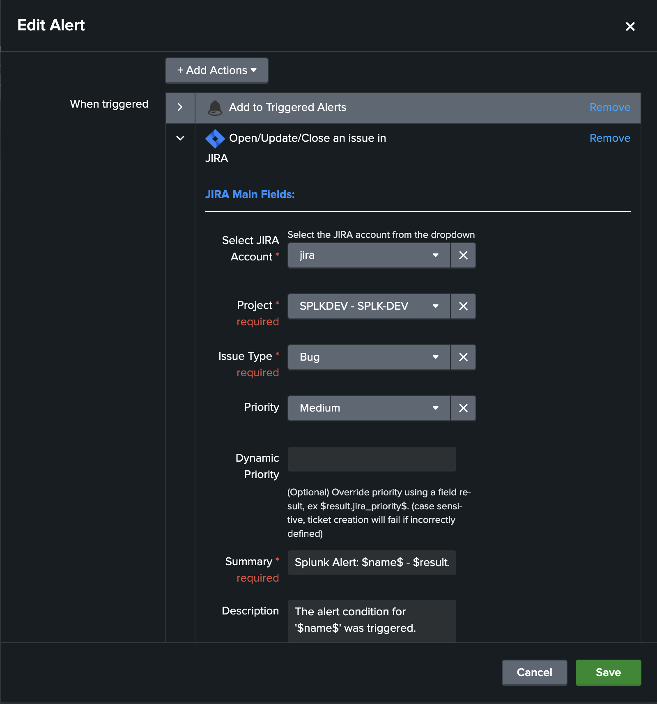

.. TA-jira-service-desk-simple-addon documentation master file, created by
   sphinx-quickstart on Tue Sep 18 23:25:46 2018.
   You can adapt this file completely to your liking, but it should at least
   contain the root `toctree` directive.

Welcome to the Splunk Add-on for JIRA Atlassian Service Desk application documentation
======================================================================================

**The Splunk Add-on for JIRA Atlassian Service Desk provides alerts action for JIRA issues creation:**

- Trigger JIRA issue creation from Splunk core alerts and Enterprise Security correlation searches
- Dynamic retrieval per JIRA project for types of issues and priority
- Dynamic assignment of priority (optional)
- Dynamic and/or static assignment of summary, description, assignee and labels
- Custom fields full capabilities via the embedded custom field structure in alerts (optional)
- Resilient store JIRA issue creation, shall a JIRA issue fails to be created, the resilient workflow handles automatic retries with a resilient policy
- Monitoring of JIRA issue workflow via the embedded Overview dashboard and out of the box alerts

.. image:: img/screenshot.png
   :alt: screenshot.png
   :align: center

Overview:
=========

.. toctree::
   :maxdepth: 2

   about
   compatibility
   support
   download

Deployment and configuration:
=============================

.. toctree::
   :maxdepth: 2

   deployment
   configuration

User guide:
===========

.. toctree::
   :maxdepth: 2

   userguide

Troubleshoot:
=============

.. toctree::
   :maxdepth: 1

Versions and build history:
===========================

.. toctree::
   :maxdepth: 1

   releasenotes.rst
