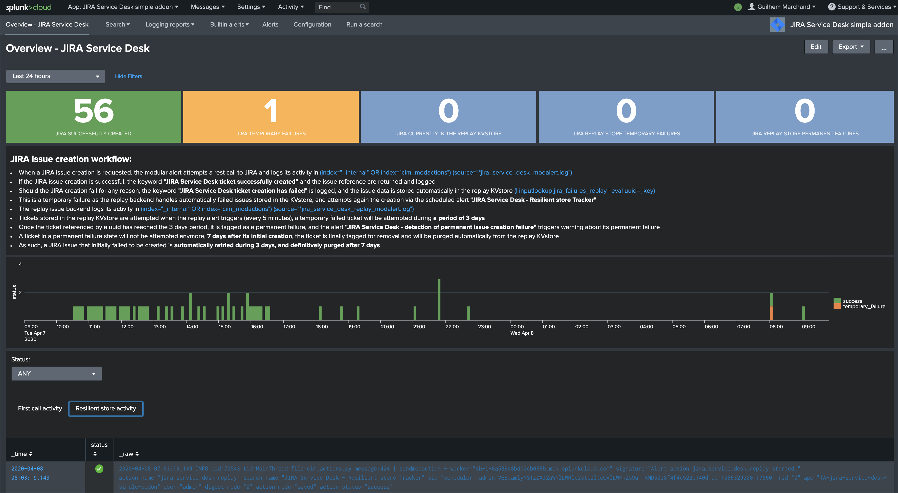

Trouble shooting
################

Overview dashboard and Add-on logs
==================================

**The Splunk Add-on for JIRA Service Desk provides a builtin Overview dashboard that gives deep insights on the Add-on activity:**

The dashboard exposes the JIRA issue workflow and direct links to access the Add-on logs.

Add-on logs for first REST call attempts
----------------------------------------

**When the alert action is triggered, the Add-on records its activity in:**

::

(index="_internal" OR index="cim_modactions") (source="*jira_service_desk_modalert.log")

When the JIRA issue is successfully achieved, the key sentence ``JIRA Service Desk ticket successfully created`` is logged.

If an error is encountered during the API call, the key sentence ``JIRA Service Desk ticket creation has failed`` is logged.

When the failure step is reached, for example if there is an issue with the credentials or reaching the JIRA instance, the workflow records the failure in a resilient store based on a KVstore lookup:

::

    | inputlookup jira_failures_replay | eval uuid=_key

At this point, any failed call recorded in the KVstore is automatically re-attempted by the scheduled alert named: ``JIRA Service Desk - Resilient store Tracker``

An out of box alert named ``JIRA Service Desk - detection of temporary issue creation failure`` is provided to monitor and track any JIRA failure, **the alert is by default enabled**.

Add-on logs for the resilient store feature
-------------------------------------------

**The resilient store feature tracks its activity in:**

::

    (index="_internal" OR index="cim_modactions") (source="*jira_service_desk_replay_modalert.log")

In normal circumstances, which means there have not been recent failed attempts, there would be no activity in this logs, nor content in the KVstore.

If a record exists in the KVstore, the Add-on will re-attempt the creation every 5 minutes during 3 days per record, if it continuously failed durant that period, a key sentence ``permanent failure!`` is logged.

An out of box alert named ``JIRA Service Desk - detection of permanent issue creation failure`` is provided to monitor and track permanent JIRA failures, **the alert is by default enabled**.

After 7 days in the KVstore, a record is automatically and definitively purged.

Root cause for failures
-----------------------

**Root causes of failures will be clearly exposes in the Add-on logs, most common causes could be:**

- JIRA credential issues (verify the connectivity, see the configuration page)
- Networking issues or JIRA instance not reachable
- Content issues such as JIRA fields not available on the JIRA project (make sure these fields are associated with the right JIRA screens)
- Content issues such as JIRA field receiving an unexpected content or format (some JIRA fields such as date and date time inputs require a valid format, etc)

**Shall a REST call for JIRA issue creation fail, the Add-on automatically logs full JSON data which you can use to easily review the data and trouble shoot the root causes.**
