User guide
##########

Using the JIRA Service Desk alert action
========================================

**Whenever you create or configure a Splunk core alert or Enterprise Security correlation search, you can now select the JIRA Service Desk action to automatically create a new JIRA issue based on the results of a search.**

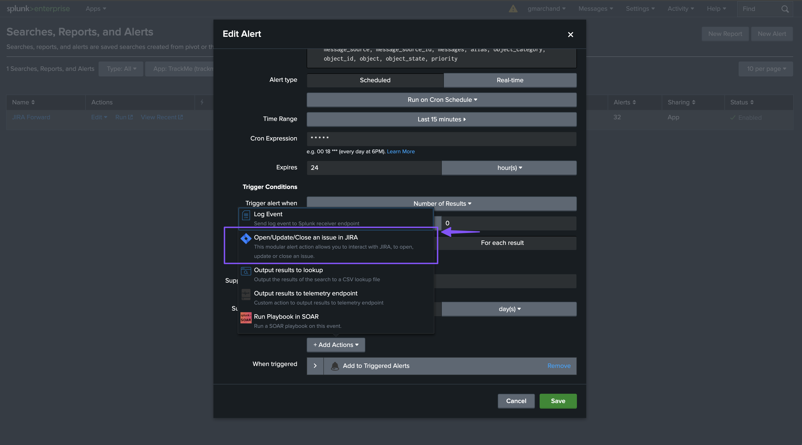

The configuration of the alert is pretty straightforward and described in details in the further sections of the above documentation.

JIRA project
============

Several projects might have been created in your JIRA instance, you can choose any of the projects available on per alert basis.

The list of JIRA projects made available within the configuration screen is the result of a dynamic REST call achieved against your JIRA instance anytime you access this screen, which can be reproduced manually too:

::

    | jirafill opt=1 | stats count by key, key_projects

JIRA issue type
===============

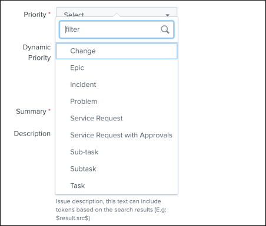

The type of issue to be created is a dynamic list provided by JIRA based on the types available for the project that has been selected, these are the result of the following command:

::

    | jirafill opt=2 | stats count by issues

JIRA issue priority
===================

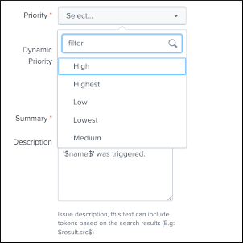

The priority of the issue is dynamically retrieved from the JIRA project based on the different priorities that are made available by your JIRA screen configuration, these are the results of the following command:

::

    | jirafill opt=3 | stats count by priorities

JIRA issue dynamic priority
===========================

**The dynamic priority is a feature that allows you to dynamically define the priority based on the search result rather than a selected priority from the dynamic list provided by JIRA.**

To use the priority of a the search results, you need to define a field in your search results that exactly match the priority value expected by JIRA, which can obviously be the results of conditional operations in your SPL logic.

*Assuming the following simplistic example in your search:*

::

    | eval jira_priority=case(count<10, "low", count>=10 AND count<50, "medium", count>=50, "high")

*You will define the dynamic priority to:* ``$result.jira_priority$``

The dynamic priority is entirely **optional** and is only used if it has been defined in the alert configuration.

JIRA summary and description
============================

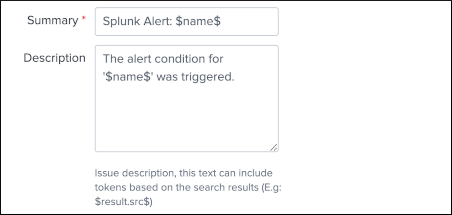

JIRA summary and description are the core information of a JIRA issue.

These two fields define the title of the JIRA issue, and its main content visible to your JIRA users.

Both fields will automatically handle any dynamic value that are available from the results of your search, which requires to be defined as ``$result.myfield$`` to be automatically translated into the relevant value.

JIRA assignee
=============

The JIRA assignee field is **optional**, and can be defined to a static or dynamic value to used to automatically assign the ticket to a specific JIRA user.

JIRA labels
===========

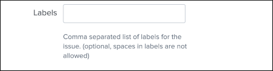

JIRA labels is an **optional** field, which can defined as a comma separated list of values to assign a list of labels to the JIRA issue.

JIRA components
===============

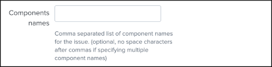

JIRA components is an **optional** field, which can defined as a comma separated list of values to assign a list of components to the JIRA issue. (by their names)

JIRA dedup
==========

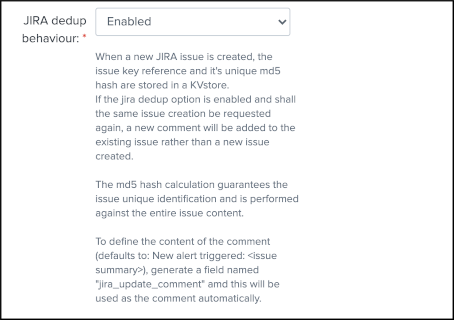

**The JIRA deduplication option is a per alert option which is disabled by default.**

**Once the option is enabled for an alert, the following workflow applies:**

- When an alert triggers with the JIRA issue creation action, the Python backend verifies the md5 hash of the full issue content to be created
- This md5 hash is compared with records stored in the backlog collection
- Shall the md5 hash be matching, the JIRA issue key reference is extracted from backlog KVstore
- As the JIRA dedup option is enabled, the Python backend will add a new comment to this JIRA issue, instead of creating a brand new issue with the entire same content
- The content os the comment can be modified (defaults to: New alert triggered: <issue summary>) by defining a field named "jira_update_comment" as port of the search results
- If the field jira_update_comment exists, its content will automatically be added as the comment

**The Overview dashboard exposes tickets that have been updated due to deduplication as "success_update" rather than "success" for a standard creation:**

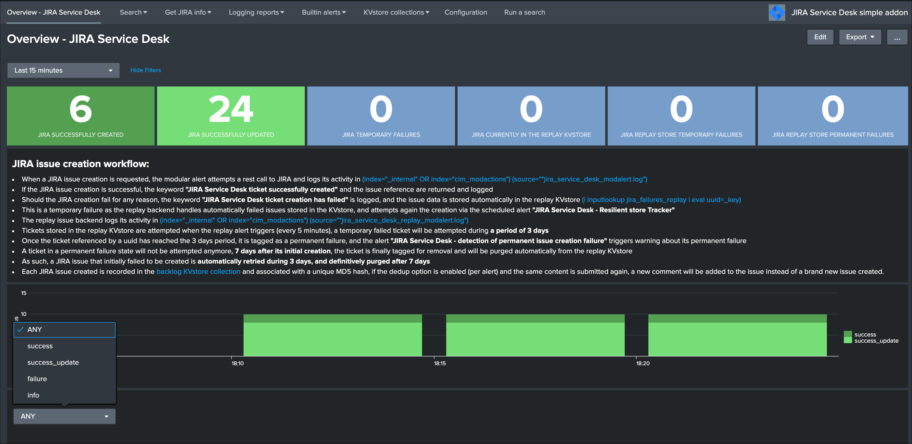

**When a ticket is detected as a duplication creation request due to md5 matching, the backend logs events that describe its activity:**

::

    JIRA Service Desk ticket successfully updated

The JIRA returned information are logged as well and contain the ticket reference key, id, and more.

**Open the report "JIRA Service Desk - Issues backlog collection" to access the backlog collection:**

- **key** is the internal uuid of the KVstore, as well the key will be equal to the md5 hash of the first occurrence of JIRA issue created (next occurrences will have a key uuid generated automatically with no link with the md5 of the issue)
- **ctime** is the milliseconds epochtime that corresponds to the initial creation of the ticket, this value not change once the record is inserted
- **mtime** is the milliseconds epochtime of the last modification of the record, if a comment is added to this ticket, this values corresponds to the time of that action
- **jira_md5** is the actual md5 hash for the entire JIRA issue, when the dedup option is activated for an alert, this will always be equal to the key id of the record in the KVstore
- **status** reflects the status of the issue as it is known from the add-on perspective, created means the issue was created, updated means at least one comment was made to this ticket due to dedup matching
- **jira_id / jira_key / jira_self** are JIRA information related to this ticket

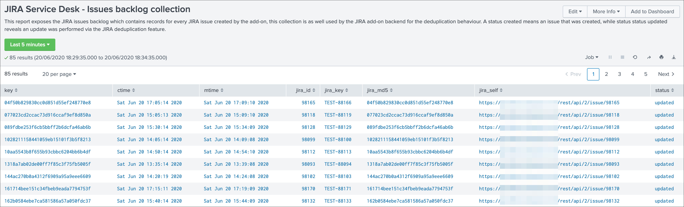

JIRA custom fields
==================

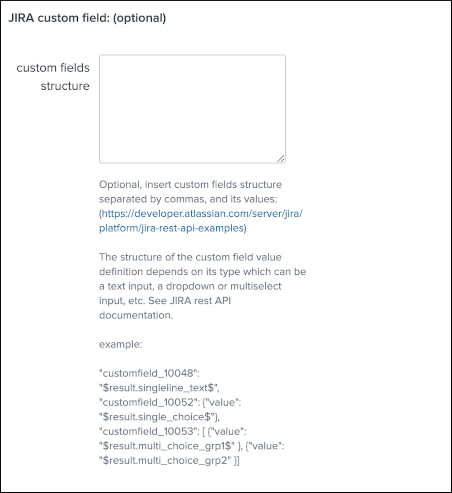

**JIRA custom fields are fields that can designed by your JIRA administrators to be available during the issue creation.**

The Splunk Add-on for JIRA Service Desk supports any kind and any number of custom fields by allowing you to insert a custom field JSON structure im the alert configuration.

**There are different types of custom fields, from a single ling text input to date and time pickers, which are described in the JIRA API documentation:**

https://developer.atlassian.com/server/jira/platform/jira-rest-api-examples

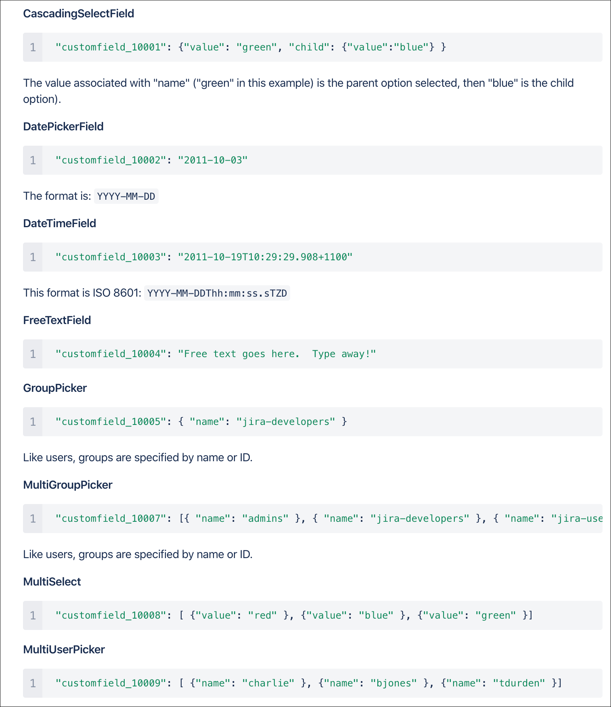

**Depending on the format of the custom field, you need to use the proper syntax, the most common are:**

::

    "customfield_10048": "$result.singleline_text$",

::

    "customfield_10052": {"value": "$result.single_choice$"},

::

    "customfield_10053": [ {"value": "$result.multi_choice_grp1$" }, {"value": "$result.multi_choice_grp2" }]

**As usual, while you define the custom fields, you can use dynamic results from the Splunk search results by using the syntax:** ``$result.myfield$``

To add a list of custom fields, make sure you add a comma after each custom field, and none at the end of the JSON structure.

*A full example o structure is provided in the alert action screen:*

::

    "customfield_10048": "$result.singleline_text$",
    "customfield_10052": {"value": "$result.single_choice$"},
    "customfield_10053": [ {"value": "$result.multi_choice_grp1$" }, {"value": "$result.multi_choice_grp2" }]

How to retrieve the IDs of the custom fields configured ?
---------------------------------------------------------

**Use the builtin report and associate custom command to retrieve the list of JIRA fields information:**

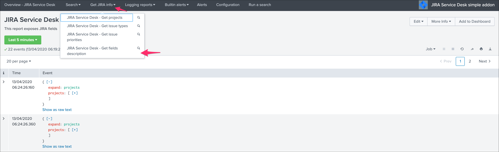

**This report achieves a REST call to JIRA to get the list of fields and their details per project and per type of issues, search for custom fields:**

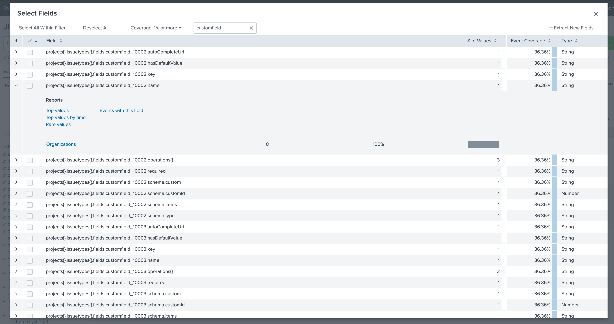
