User guide
##########

.. admonition:: **About the JIRA Alert Actions:**

   - This application provides a sophisiticated and advanced alert action, which notably allows automated bi-directional integration with the JIRA API.
   - There are various parameters that allow controlling its behaviors, which used in association with Splunk language capabilities allows for powerful interactions with JIRA.
   - You can for instance automatically detect duplicated issues, and instead have the alery action adding a comment to the existing issue, or even automatically close the issue based on pattern detection.
   - Not all parameters are mandatory, and in fact only a few few are required to be configured to get the alert actions working.
   - Read this guide carefully to understand how to use the alert actions, and how to configure them properly.

Using the JIRA Service Desk alert action from alerts and correlation searches
=============================================================================

**Whenever you create or configure a Splunk core alert or Enterprise Security correlation search, you can now select the JIRA Service Desk action to automatically create a new JIRA issue based on the results of a search.**

The configuration of the alert is pretty straightforward and described in detail in the further sections of the above documentation.

Using the JIRA Service Desk alert adaptive response action from Splunk Enterprise Security
==========================================================================================

**In Splunk Enterprise Security, the JIRA action can be triggered as an adaptive response action from Incident Review:**

.. image:: img/userguide1_ar.png
   :alt: userguide1_ar.png
   :align: center
   :width: 800px
   :class: with-border

The same options are available with the same level of features; however, tokens expansion will depend on the notable event context.

JIRA account & project
======================

The JIRA account and the associated project you want to use are the first parameters to configure in the alert action, it allows you to select the JIRA project you want to use for the alert action.

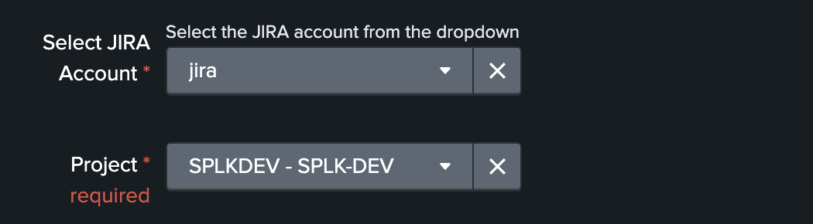

Several projects might have been created in your JIRA instance; you can choose any of the projects available on per alert basis.

The list of JIRA projects made available within the configuration screen is the result of a dynamic REST call achieved against your JIRA instance anytime you access this screen, which can be reproduced manually too:

::

    | jirafill account=_all opt=1 | stats values(key) as key, values(key_projects) as key_projects by account

JIRA issue type
===============

The type of issue to be created is a dynamic list provided by JIRA based on the types available for the project that has been selected, these are the result of the following command:

::

    | jirafill account=_all opt=2 | stats values(issues) as issues by account

JIRA issue priority & dynamic priority
======================================

You can define the priority of the issue in two ways, either statically or dynamically.

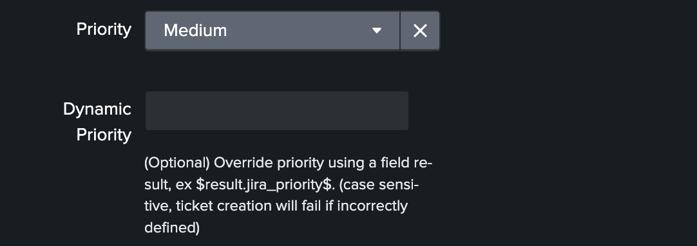

Static priority
---------------

The priority of the issue is dynamically retrieved from the JIRA project based on the different priorities that are made available by your JIRA screen configuration, these are the results of the following command:

::

    | jirafill account=_all opt=3 | stats values(priorities) as priorities by account

Dynamic priority
----------------

**The dynamic priority is a feature that allows you to dynamically define the priority based on the search result rather than a selected priority from the dynamic list provided by JIRA.**

To use the priority of the search results, you need to define a field in your search results that exactly match the priority value expected by JIRA, which can obviously be the results of conditional operations in your SPL logic.

*Assuming the following simplistic example in your search:*

::

    | eval jira_priority=case(count<10, "low", count>=10 AND count<50, "medium", count>=50, "high")

*You will define the dynamic priority to:* ``$result.jira_priority$``

The dynamic priority is entirely **optional** and is only used if it has been defined in the alert configuration.

JIRA summary and description
============================

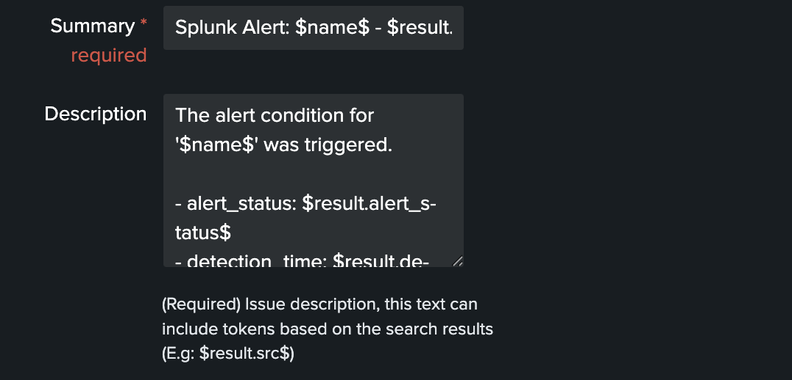

JIRA summary and description are the core information of a JIRA issue.

These two fields define the title of the JIRA issue, and its main content visible to your JIRA users.

Both fields will automatically handle any dynamic value that are available from the results of your search, which requires to be defined as ``$result.myfield$`` to be automatically translated into the relevant value.

JIRA attachment
===============

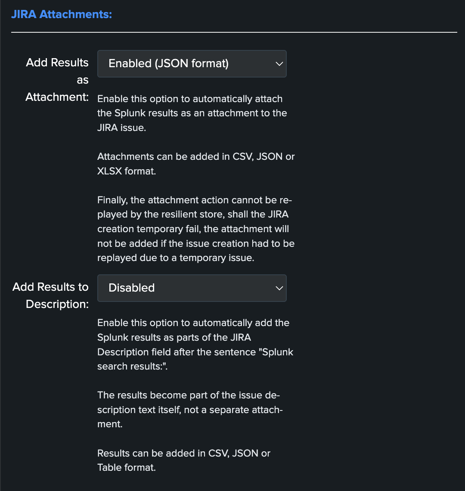

**On a per alter basis, the results from the Splunk alert that triggered can automatically be attached to the JIRA issue.**

**Features and limitations:**

- The attachment feature is disabled by default, and needs to be enabled on a per alert basis
- The format of the results can be attached in CSV format, JSON or XLS (Excel) format
- The feature is not compatible with the resilient store, if the JIRA issue initially fails due to a temporary failure, the ticket will be created by the resilient tracker when possible but without the original attachment

*When the attachment option is enabled, the following message will be logged if the attachment was successfully added to the JIRA issue, in addition with details of the ticket returned by JIRA:*

``JIRA Service Desk ticket attachment file uploaded successfully``

**File attachment in JIRA:**

*Note: the file name is dynamically generated, prefixed with "splunk_alert_results_" and suffixed by the relevant file extension.*

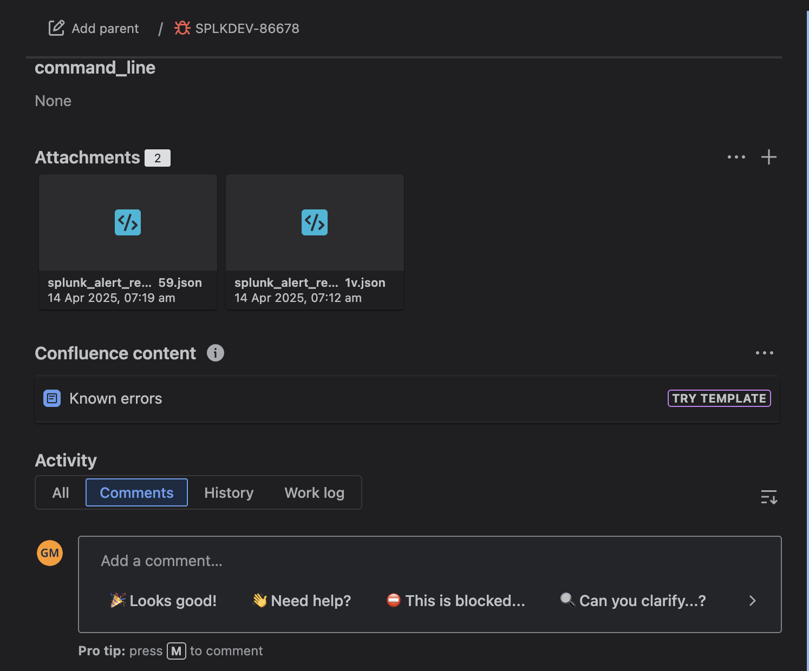

JIRA Auto Close
===============

.. admonition:: **Auto Closure capabilities introduced in version 2.1.0**

   - The JIRA Service Desk Add-on now supports the auto closure of issues based on pattern detection in the events of the alert
   - This is advanced feature which only requires a few configuration options to be effective.
   - Althrough it is enabled by default, it will not do any action until it is configured properly.
   - By leveraging auto closure, you can close an issue based on the value of a field in the result of your SPL search, which provides a very powerful way to automatically manage state aware contexts.
   - Finally, the ideal scenario is to use it in combination with the JIRA deduplication feature, which allows the JIRA App to automatically link the issue to the associated event.

*Auto Close configuration items:*

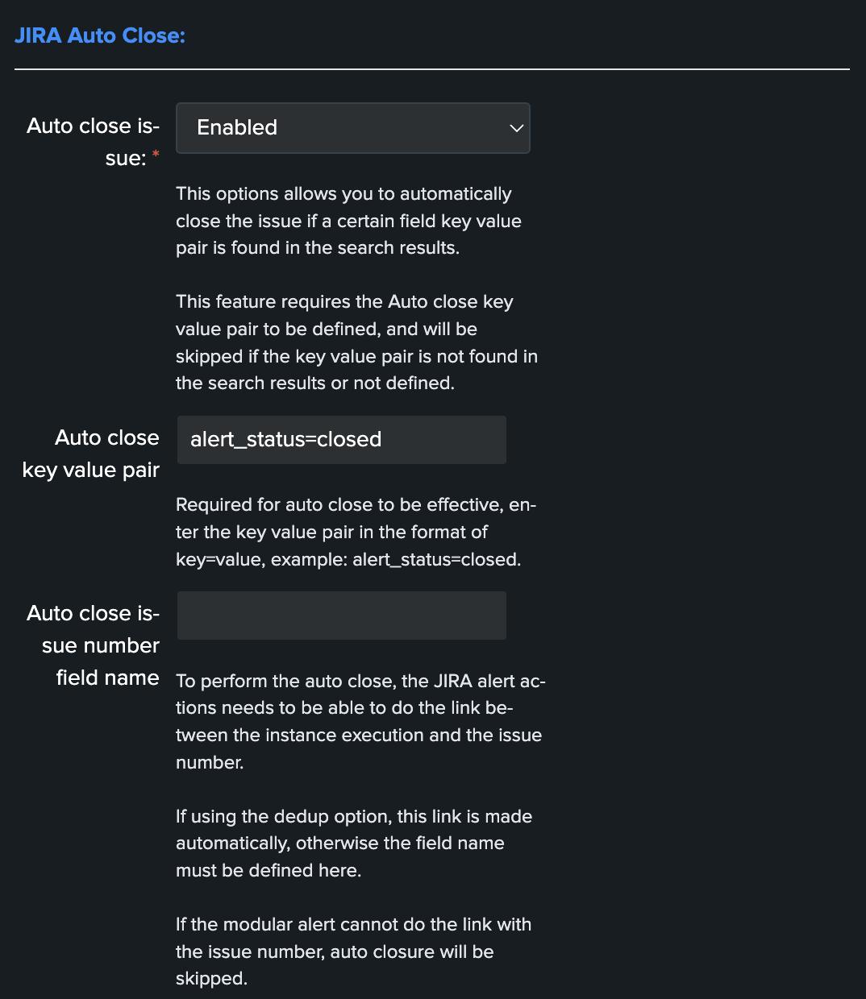

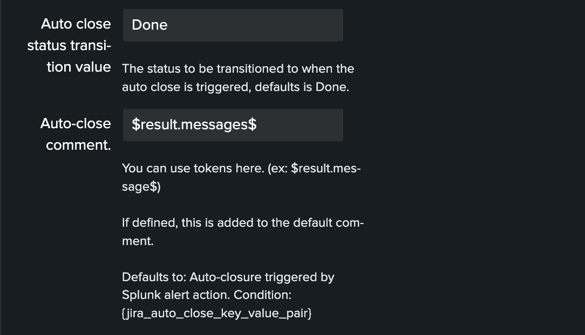

Auto Close scenario example
---------------------------

**In this example, we work with TrackMe StateFul alerts:**

- https://docs.trackme-solutions.com/latest/admin_guide_alerts.html#introduction-to-stateful-alerting-in-trackme

**We have defined an alert strategy which leverages the ready to use stateful events generated by TrackMe:**

::

   index=trackme_summary sourcetype="trackme:stateful_alerts" priority IN ("high", "critical")
   | rename "messages{}" as messages
   | table alert_status, detection_time, drilldown_link, event_id, incident_id, message_source, message_source_id, messages, alias, object_category, object_id, object, object_state, priority

In these events, we have a field called ``incident_id`` which is the id of the incident generated by TrackMe for a given entity, from our perspective this provides out of the box what we can rely only to identify what should be a unique issue in JIRA!

We will first intruct the JIRA alert action to use the ``incident_id`` as the content for the JIRA dedup condition:

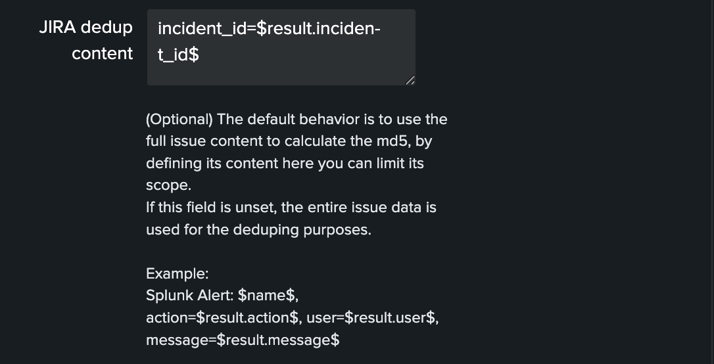

Then, these events contain a field called ``alert_status`` which take values like:

- ``open``
- ``updated``
- ``closed``

We can transparently rely on this field to understand if the issue should be closed automatically, based on the fact that the source of the incident is now closed:

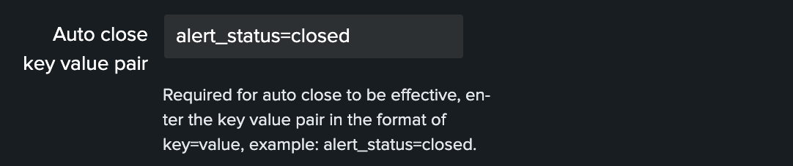

We will also include a field from the event called ``messages`` which will be included in the comment added when performing the issue status transition;

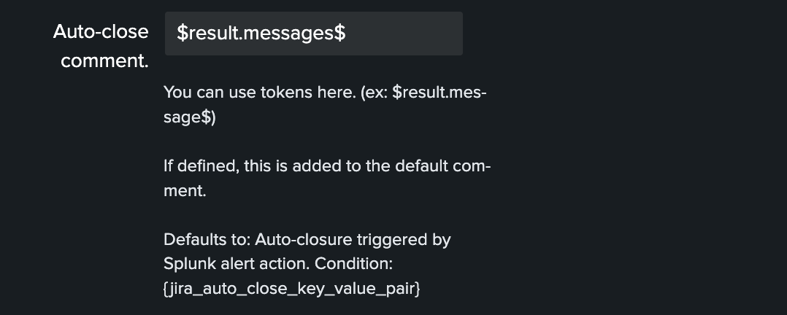

When an incident is created, the associated JIRA issue is created:

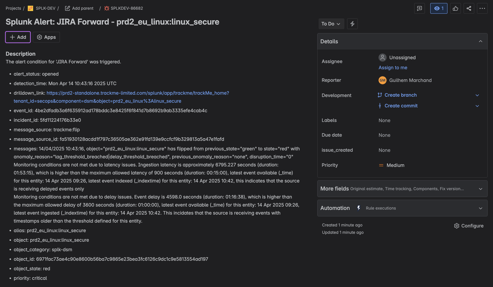

if at some points, an update new event is created by TrackMe, our dedup feature detects it and adds a comment to the issue: (at this point, this is not a closure yet)

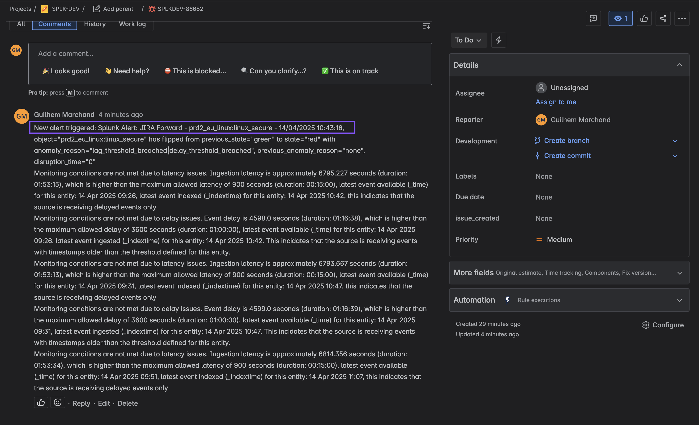

Finally, when the incident is closed on the TrackMe side, and it generated an event with alert_status=closed, the JIRA alert action auto-close feature will detect it and close the issue:

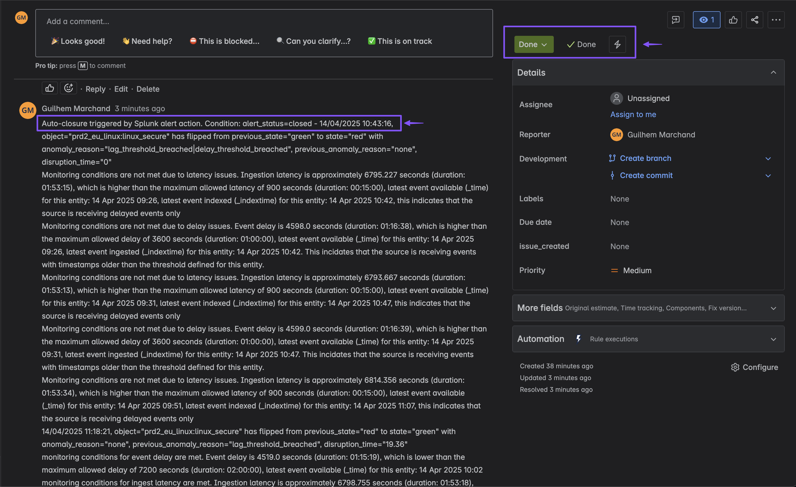

JIRA Assignee, Reporter and Metadata
====================================

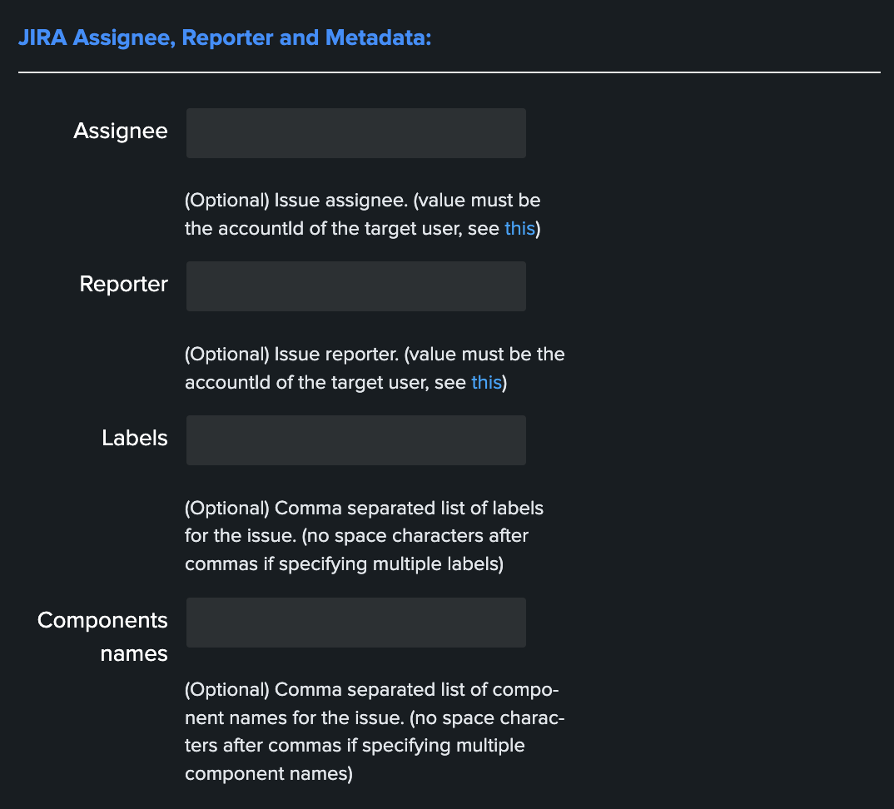

Assignee and Reporter
---------------------

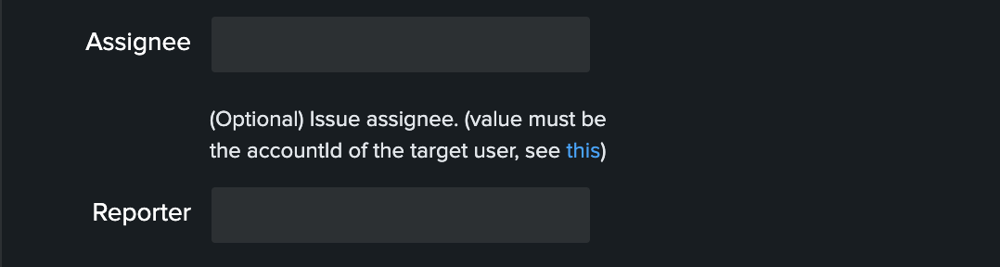

**Both the assignee and the reporter can be defined in the alert action, to do so the follow these instructions:**

- Retrieve the accountId value for the target JIRA user
- This ID is the value you need to submit in both fields, in most JIRA configuration emails or usernames will be refused and ignored by JIRA
- You can get retrieve easily the accountId value using any valid JIRA issue, as follows

::

   | jirarest account="<account>" target="rest/api/latest/issue/<issue key>" method="GET"

*Then locate the accountId value, example:*

*Finally, assign the accountId value in your alert action, example:*

Labels
------

JIRA labels is an **optional** field, which can be defined as a comma separated list of values to assign a list of labels to the JIRA issue.

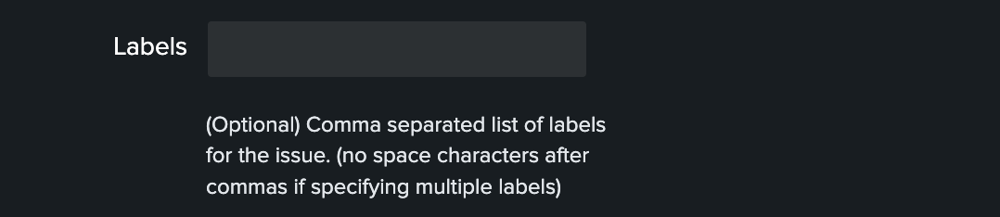

Components
----------

JIRA components is an **optional** field, which can be defined as a comma separated list of values to assign a list of components to the JIRA issue. (by their names)

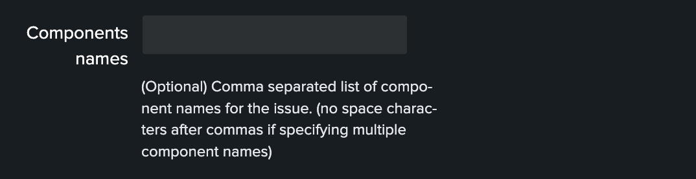

JIRA dedup behavior
====================

**The JIRA deduplication is a powerful feature that allows to automatically control the decision to create or update an issue, which relies on a bidirectional integration with JIRA.**

**The feature relies on 3 main options:**

- ``JIRA dedup behaviour:`` this enables the dedup feature, disabled by default
- ``JIRA dedup excluded status categories:`` A comma seperated list of statuses that will be considered for the decision
- ``JIRA dedup content:`` (Optional) Provides extra control on the content used to make the decision

**Let's take the following example to explain how the feature works:**

*The following search simulates an alert triggering:*

::

   | makeresults
   | eval user="foo@splunk.com", action="failure", reason="Authentication failed"
   | eval time=strftime(_time, "%c")

- everytime the alert triggers, the values for user, action and reason remain the same
- the time value differs every time the action triggers

Let's enable the JIRA alert action, we'll include in the description field all the fields from resulting from the alert:

For now, we didn't enable the dedup feature, if we use the ``DEBUG`` logging mode, the logs will show the full JSON payload sent to the JIRA API in pretty print manner:

*Use the navigation bar shortcut to access the logs, the final JSON is logged with a message: json data for final rest call*

Even if we didn't enable yet the feature, the Addon calculates an MD5 sum which is recorded in a KVstore collection, traces are logged about this:

::

   2021-06-25 20:33:05,394 DEBUG pid=5759 tid=MainThread file=cim_actions.py:message:243 | sendmodaction - signature="jira_dedup: The calculated md5 hash for this issue creation request (db05a46bd3a2e6ccb57906cd749db047) was not found in the backlog collection, a new issue will be created" action_name="jira_service_desk" search_name="Test JIRA - demo dedup" sid="scheduler__admin__search__RMD526ad4cfa87997743_at_1624653180_13" rid="0" app="search" user="admin" action_mode="saved"

The MD5 sum is calculated against the entire JSON data.

To access the KVstore collection containing these records, look at the nav menu "KVstore collections / JIRA Service Desk - Issues backlog collection".

As every ticket corresponds to a new issue, the status is "created".

**Now, let's modify a bit the alert, we will remove the time field from the description in JIRA, and enable the dedup:**

As the content of the JSON is exactly the same (we removed the time from the description), the Addon will detect it and perform an update of first created issue, adding a comment, and updating the record in the KVstore lookup:

::

   2021-06-25 20:45:06,360 INFO pid=8814 tid=MainThread file=cim_actions.py:message:243 | sendmodaction - signature="jira_dedup: An issue with same md5 hash (60727858c049e599fdb68a3cd744a911) was found in the backlog collection, as jira_dedup is enabled a new comment will be added if the issue is active. (status is not resolved or any other done status), entry:={ "jira_md5" : "60727858c049e599fdb68a3cd744a911", "ctime" : "1624652826.254012", "mtime" : "1624652826.2540202", "status" : "created", "jira_id" : "10100", "jira_key" : "LAB-76", "jira_self" : "https://localhost:8081/rest/api/2/issue/10100", "_user" : "nobody", "_key" : "60727858c049e599fdb68a3cd744a911" }" action_name="jira_service_desk" search_name="Test JIRA - demo dedup" sid="scheduler__admin__search__RMD526ad4cfa87997743_at_1624653900_33" rid="0" app="search" user="admin" action_mode="saved" action_status="success"

**The KVstore collection shows a status "updated" for the issue:**

**The Addon UI shows as well that updates were performed rather than new issues creation:**

**The issue itself in JIRA shows new comments added everytime the alert triggered for the same content:**

**We can control the content of the comment added to the issue by creating a custom field in the resulting Splunk alert, let's modify the alert to include a new field used to control the comment:**

::

   | makeresults
   | eval user="bar@splunk.com", action="failure", reason="Authentication failed"
   | eval time=strftime(_time, "%c")
   | eval jira_update_comment="The same condition was detected by Splunk for the user=" . user . " with action=" . action . " and reason=" . reason . ", therefore a new comment was adeed to the JIRA issue."

**After the first issue creation, the next time the alert triggers, the Addon will use the content of the "jira_update_comment" field and use in the comment field in JIRA:**

*Issue initially created:*

*Issue updated with our comment field:*

.. image:: img/dedup/dedup11.png
   :alt: dedup11.png
   :align: center
   :width: 1200px 
   :class: with-border  

*Now, let's say this issue is taken in charge in JIRA, it status is changed to Done as we think the underneath condition is fixed:*

This is where the second dedup option acts, thanks to this bi-directional integration, the Addon knows that the issue was fixed and decides to open a new issue.

An INFO message is logegd explaining why the Addon took this decision:

::

   2021-06-26 09:42:06,237 INFO pid=13894 tid=MainThread file=cim_actions.py:message:243 | sendmodaction - signature="jira_dedup: The issue with key LAB-109 has the same MD5 hash: 60727858c049e599fdb68a3cd744a911 and its status was set to: "Done" (status category: "Done"), a new comment will not be added to an issue in this status, therefore a new issue will be created." action_name="jira_service_desk" search_name="Test JIRA - demo dedup" sid="scheduler__admin__search__RMD526ad4cfa87997743_at_1624700520_67" rid="0" app="search" user="admin" action_mode="saved" action_status="success"

If you have custom statuses, you can update the list of statuses to be taken into account in the alert definition, the Addon accepts a comma separated list of statuses.

**Now, let's say that we need to have more information added into our JIRA ticket, some will not change if the same alert triggers for the same condition, but others that we need such as the time field will always differ.**

To achieve our goal, we will use the third option to "scope" what the Addon will use for the MD5 generation that is used to idenfity a duplicate issue, we will generate a specific field in the Splunk alert and recycle its value in the alert definition:

::

   | makeresults
   | eval user="foo@splunk.com", action="failure", reason="Authentication failed"
   | eval time=strftime(_time, "%c")
   | eval jira_update_comment="The same condition was detected by Splunk for the user=" . user . " with action=" . action . " and reason=" . reason . ", therefore a new comment was adeed to the JIRA issue."
   | eval dedup_condition = "user=" . user . "|action=" . action . "|reason=" . reason

**Then, we modify our alert action to ask the Addon to use this token variable for the MD5 generation:**

note: ``$result.dedup_condition$`` is how you will instruct Splunk to recycle dynamically the value of the field dedup_condition and pass it in the alert action.

We have now changed the way we idenfity what is a duplicate, and what is not, we can have fields which content will always change like our time field without breaking the dedup idenfitication:

**When the alert triggers more than once, we can see a new comment added to our issue:**

The same workflow applies again, if we fix the issue the Addon will detect it and create a new ticket, if something happens to be different in the condition for the dedup idenfitication, a new ticket will be created.

Powerful, isn't?!

*Additional information about the KVstore knowledge records:*

- **key** is the internal uuid of the KVstore, as well the key will be equal to the md5 hash of the first occurrence of JIRA issue created (next occurrences will have a key uuid generated automatically with no link with the md5 of the issue)
- **ctime** is the milliseconds epochtime that corresponds to the initial creation of the ticket, this value can not be changed once the record is created
- **mtime** is the milliseconds epochtime of the last modification of the record, if a comment is added to this ticket, this value corresponds to the time of that action
- **jira_md5** is the actual md5 hash for the entire JIRA issue, when the dedup option is activated for an alert, this will always be equal to the key id of the record in the KVstore
- **status** reflects the status of the issue as it is known from the add-on perspective, created means the issue was created, updated means at least one comment was made to this ticket due to dedup matching
- **jira_id / jira_key / jira_self** are JIRA information related to this ticket

.. image:: img/jira_dedup3.png
   :alt: jira_dedup3.png
   :align: center
   :width: 1200px   

JIRA custom fields
==================

.. image:: img/userguide9.png
   :alt: userguide9.png
   :align: center
   :class: with-border

**JIRA custom fields are fields that can designed by your JIRA administrators to be available during the issue creation.**

The Splunk Add-on for JIRA Service Desk supports any kind and any number of custom fields by allowing you to insert a custom field JSON structure in the alert configuration.

**There are different types of custom fields, from a single ling text input to date and time pickers, which are described in the JIRA API documentation:**

https://developer.atlassian.com/server/jira/platform/jira-rest-api-examples

.. image:: img/userguide10.png
   :alt: userguide10.png
   :align: center
   :width: 800px  
   :class: with-border 

**Depending on the format of the custom field, you need to use the proper syntax, the most common are:**

::

    "customfield_10048": "$result.singleline_text$",

::

    "customfield_10052": {"value": "$result.single_choice$"},

::

    "customfield_10053": [ {"value": "$result.multi_choice_grp1$" }, {"value": "$result.multi_choice_grp2" }]

**As usual, while you define the custom fields, you can use dynamic results from the Splunk search results by using the syntax:** ``$result.myfield$``

To add a list of custom fields, make sure you add a comma after each custom field, and none at the end of the JSON structure.

*A full example JSON structure is provided in the alert action screen:*

::

    "customfield_10048": "$result.singleline_text$",
    "customfield_10052": {"value": "$result.single_choice$"},
    "customfield_10053": [ {"value": "$result.multi_choice_grp1$" }, {"value": "$result.multi_choice_grp2" }]

**Custom fields parsing:**

By default, the content of the custom fields is parsed to escape and protect any special characters that would potentially lead the JSON data not to be parsed properly.

In some circumstances, the built-in parser rules may fail to recognize an unexpected custom fields structure, the parsing can be disabled if required:

.. image:: img/customfields_parsing.png
   :alt: img/customfields_parsing.png
   :align: center
   :width: 800px 
   :class: with-border   

Datetime picker example:
------------------------

See:
https://github.com/guilhemmarchand/TA-jira-service-desk-simple-addon/issues/191

Expected format:

::

   "customfield_10003": "2011-10-19T10:29:29.908+1100"
   This format is ISO 8601: YYYY-MM-DDThh:mm:ss.sTZD   

Example Splunk SPL search:

::

   | makeresults
   | eval user=md5(_time), action="failed", message="Test custom field"
   | eval issue_created=strftime(_time, "%Y-%m-%dT%H:%M:%S.%3N%z")

Example custom field definition:

::

   "customfield_10039": "$result.issue_created$"   

How to retrieve the IDs of the custom fields configured ?
---------------------------------------------------------

**Use the built-in report and associate custom command to retrieve the list of JIRA fields information:**

.. image:: img/userguide_getfields1.png
   :alt: userguide_getfields1.png
   :align: center
   :width: 1200px   
   :class: with-border

**This report achieves a REST call to JIRA to get the list of fields and their details per project and per type of issues, search for custom fields:**

.. image:: img/userguide_getfields2.png
   :alt: userguide_getfields2.png
   :align: center
   :width: 1200px   
   :class: with-border

JIRA REST API wrapper
=====================

**A custom command is provided as a generic API wrapper which can be used to get information from JIRA by calling any REST endpoint available:**  
By default, it uses method GET. Additional methods are supported DELETE, POST, PUT.

::

   | jirarest target="<endpoint>"

**Open the REST API dashboard to get examples of usage:**

.. image:: img/jirarest_001.png
   :alt: jirarest_001.png
   :align: center
   :width: 1200px   
   :class: with-border

**The following report is provided to retrieve issues statistics per project and per status categories:**

::

   JIRA Service Desk - Issues statistics report per project

.. image:: img/jirarest_002.png
   :alt: jirarest_002.png
   :align: center
   :width: 1200px   
   :class: with-border

JIRA Overview custom command
============================

**A custom command is provided which retrieves Jira projects issues main KPIs for all configured Jira accounts:**

::

   | jiraoverview

This command is used by the Overview JIRA Projects dashboards.

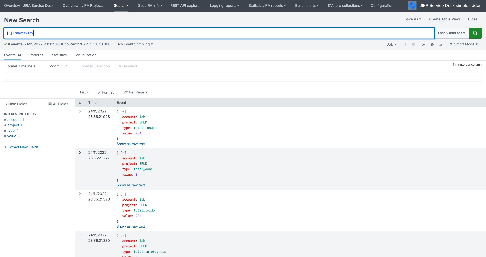

Indexing JIRA statistics for reporting purposes
-----------------------------------------------

**If you wish to index the JIRA statistic results in Splunk for reporting purposes over time, you can easily modify or clone this report to use collect or mcollect to index these statistics:**

Indexing the results to a summary report
^^^^^^^^^^^^^^^^^^^^^^^^^^^^^^^^^^^^^^^^

You can use the ``collect`` command to automatically index the report results in a summary index of your choice, schedule this report and add a call to collect, example:

::

   | collect index=summary source="JIRA - issues stats per project"

.. image:: img/jirarest_003.png
   :alt: jirarest_003.png
   :align: center
   :width: 1200px 
   :class: with-border  

Indexing the results to a metric index
^^^^^^^^^^^^^^^^^^^^^^^^^^^^^^^^^^^^^^

Another option is to use the mcollect command to automatically index these statistics as native metrics in a metric index of your choice, the following example assumes a metric index named "jira_metrics" was created, the report scheduled and the following mcollect command is added:

::

   | eval type="jira_" | mcollect split=t prefix_field=type index=jira_metrics project

Each statistic is stored as a metric_name with a prefix "jira\_", while the project is stored as a dimension, you can use the mcatalog and mstats commands to use the metrics, or use the Analytics view in Splunk:

*mcatalog example:*

::

   | mcatalog values(metric_name) values(_dims) where index=jira_metrics metric_name=jira_*

*mstats example:*

::

   | mstats latest(jira_pct_total_done) as pct_total_done, latest(jira_pct_total_in_progress) as pct_total_in_progress, latest(jira_pct_total_to_do) as pct_total_to_do where index=jira_metrics by project span=5m

.. image:: img/jirarest_004.png
   :alt: jirarest_004.png
   :align: center
   :width: 1200px  
   :class: with-border 

Additional examples for JIRA API wrapper
----------------------------------------

Method DELETE: Delete an issue
^^^^^^^^^^^^^^^^^^^^^^^^^^^^^^

::

   | jirarest target="rest/api/2/issue/{issueIdOrKey}" method=DELETE

Method POST: Add a comment to an issue
^^^^^^^^^^^^^^^^^^^^^^^^^^^^^^^^^^^^^^

*Example 1:*

::

   | jirarest target="rest/api/2/issue/{issueIdOrKey}/comment" method=POST json_request="{\"body\": \"This is a normal comment.\"}"

*Example 2:*

::

   | jirarest target="rest/api/2/issue/{issueIdOrKey}/comment" method=POST json_request="{\"body\": \"This is a comment that only administrators can see.\", \"visibility\": {\"type\": \"role\", \"value\": \"Administrators\"}}"

Method PUT: Assign an issue
^^^^^^^^^^^^^^^^^^^^^^^^^^^

::

   | jirarest target="rest/api/2/issue/{issueIdOrKey}/assignee" method=PUT json_request="{\"name\": \"harry\"}"
